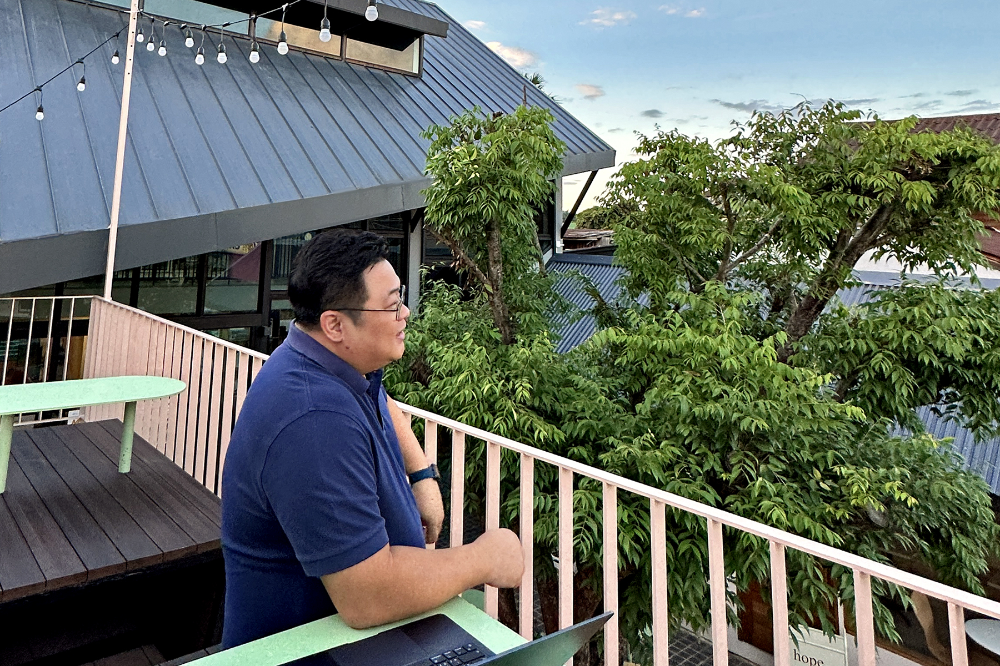

I'm Chakkrisn <em>Menn</em> Talawat, a web designer and developer who transitioned from Bangkok to Pai, leading the team at <a href="https://seedwebs.com/" target="_blank">Seed Webs.</a>

## 2003

Upon returning from studying Media Production in the US, I launched **TiGER iDEA**, my first web studio in Bangkok, with the support of my former boss.

## 2011

I volunteered to teach design and web development at the **Maehongson IT Valley** project by NECTEC and co-founded **SAM YARN** Digital Agency before relocating to Pai.

## 2016

I established **Seed Themes** in Pai, focusing on WordPress theme development and recruiting recent graduates from Mahongson and Chiang Mai.

## 2017

I found love in Pai with a local nurse and build our home toghether.

## 2020

I rebranded my company as **Seed Webs**, expanding into various JavaScript technologies like React, MongoDB, Next.js, Directus and Astro, while staying innovative and lean.

## 2024

Craft this website using Astro and share my story with the world.
